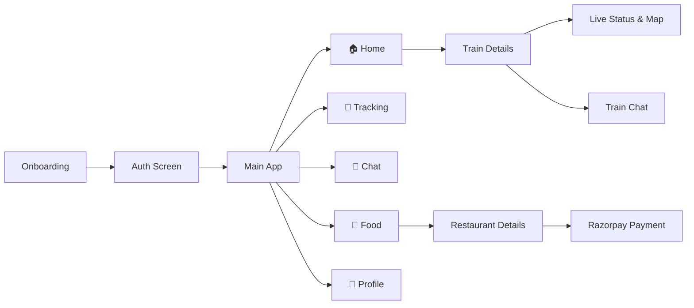

<div align="center">

# 🚆 RailLive

### *Real-Time Railways at Your Fingertips*

Track live trains · Check PNR · Chat with passengers · Order food at your seat

<br/>


<br/>

[Features](#-features) ·
[Quick Start](#-quick-start) ·
[Setup](#-setup) ·
[Architecture](#-architecture) ·
[APIs](#-apis)

---

</div>

## 📖 About

**RailLive** is a comprehensive Flutter mobile app built for Indian Railways travelers. Search any train by number or name, follow its live journey station-by-station with integrated maps, check your PNR booking status, order delicious meals directly to your seat, and join a real-time chat room with fellow passengers on the same train — all in one place.

> 🎯 **Mission** — Make railway travel smarter, simpler, and more connected.

<br/>

## ✨ Features

<table>
<tr>
<td width="50%" valign="top">

### 🔍 Train Search
Search by **5-digit train number** or **train name** with instant autocomplete. Find trains between any two stations with ease.

### 📡 Live Status & Maps
Real-time station-by-station tracking with **delay info**, **ETA**, and **interactive maps** powered by `flutter_map`.

### 🎫 PNR Status
Look up booking status instantly. View coach position, berth details, and charting status.

</td>
<td width="50%" valign="top">

### 🍱 Food Delivery
Browse **nearby restaurants** at upcoming stations. Order food directly to your seat with secure **Razorpay** integration.

### 💬 Train Chat
Per-train chat rooms powered by **Cloud Firestore** — connect with fellow passengers on your journey.

### 👤 Profile & Orders
Manage your profile and track your food orders. Firebase-authenticated with real-time updates.

</td>
</tr>
</table>

<br/>

### 🗺️ App Flow



<br/>

### 📱 Bottom Navigation

| Tab | Description | Status |
|:---:|:---|:---:|
| 🏠 **Home** | Train search, autocomplete & recent lookups | ✅ Ready |
| 📍 **Tracking** | Dedicated tracking view with maps | ✅ Ready |
| 💬 **Chat** | Global and per-train chat hub | ✅ Ready |
| 🍱 **Food** | Nearby restaurants and food ordering | ✅ Ready |
| 👤 **Profile** | User profile & order history | ✅ Ready |

<br/>

---

## 🚀 Quick Start

```bash
git clone <repository-url>
cd rail_live
flutter pub get
# Create .env file (see Setup below)
flutter run
```

<br/>

## ⚙️ Setup

### 1️⃣ Prerequisites

| Requirement | Details |
|:---|:---|
| **Flutter SDK** | [Install Flutter](https://docs.flutter.dev/get-started/install) — Dart `^3.12.1` |
| **Firebase Project** | Auth · Firestore · Cloud Messaging |
| **RapidAPI Keys** | IRCTC Train API · PNR Status API |
| **Razorpay API** | Merchant ID & Key for payments |

<br/>

### 2️⃣ Environment Variables

Create a `.env` file in the project root:

```env
RAPID_API_KEY=your_rapidapi_key
RAPID_API_HOST=indian-railway-irctc.p.rapidapi.com
RAPID_PNP_API=your_pnr_api_key
RAZORPAY_KEY=your_razorpay_key
```

<br/>

### 3️⃣ Firebase Configuration

```bash
dart pub global activate flutterfire_cli
flutterfire configure
```

- Place `google-services.json` in `android/app/`
- `lib/firebase_options.dart` is auto-generated by FlutterFire CLI

<br/>

---

## 🏗️ Architecture

### Tech Stack

| Layer | Package |
|:---|:---|
| Framework | Flutter · Dart `^3.12.1` |
| State | [`provider`](https://pub.dev/packages/provider) |
| Maps | [`flutter_map`](https://pub.dev/packages/flutter_map) · [`latlong2`](https://pub.dev/packages/latlong2) |
| Payments | [`razorpay_flutter`](https://pub.dev/packages/razorpay_flutter) |
| Location | [`geolocator`](https://pub.dev/packages/geolocator) |
| Auth | [`firebase_auth`](https://pub.dev/packages/firebase_auth) |
| Database | Cloud Firestore · SharedPreferences |
| Notifications | [`firebase_messaging`](https://pub.dev/packages/firebase_messaging) |

<br/>

### Project Structure

```
rail_live/
│
├── 📁 lib/
│   ├── 📁 Providers/                # State management
│   ├── 📁 services/                 # API & Firebase logic
│   ├── 📁 models/                   # Data structures
│   ├── 📁 utils/                    # Helper classes (Coach, Station)
│   │
│   └── 📁 screens/
│       ├── auth_screen.dart
│       ├── 📁 restaurant/           # Food ordering flow
│       ├── 📁 onboarding_screens/   
│       ├── 📁 Profiles_pages/       # Profile & Settings
│       └── 📁 Bottom_NavigationBar_screens/
│           ├── home_screen.dart
│           ├── tracking_screen.dart
│           ├── pnr_screen.dart
│           ├── nearby_restaurant_screen.dart
│           └── 📁 train_between_stations/
│
└── 📁 assets/
    ├── 📁 data/                     # local trains & stations JSON
    └── 📁 onboarding/               
```

<br/>

---

## 🌐 APIs

| Endpoint | Host | Purpose |
|:---|:---|:---|
| `GET /api/trains-search/v1/train/{trainNo}` | `RAPID_API_HOST` | Train search & details |
| `GET /api/trains/v1/train/status` | `indian-railway-irctc.p.rapidapi.com` | Live running status |
| `GET /getPNRStatus/{pnr}` | `irctc-indian-railway-pnr-status.p.rapidapi.com` | PNR booking status |

<br/>

---

<div align="center">

### Made with ❤️ for Indian Railways travelers

*Train and PNR data are provided by third-party APIs and subject to their respective terms of service.*

<br/>

**RailLive** · Flutter · Firebase · RapidAPI · Razorpay

</div>
