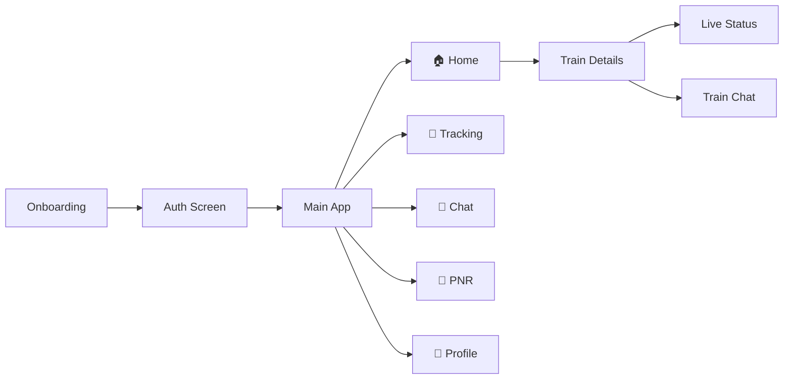

<div align="center">

# 🚆 RailLive

### *Real-Time Railways at Your Fingertips*

Track live train locations · Monitor delays · Check PNR · Chat with fellow passengers

<br/>


<br/>

[Features](#-features) ·
[Quick Start](#-quick-start) ·
[Setup](#-setup) ·
[Architecture](#-architecture) ·
[APIs](#-apis)

---

</div>

## 📖 About

**RailLive** is a Flutter mobile app built for Indian Railways travelers. Search any train by number or name, follow its live journey station-by-station, check your PNR booking status, and join a real-time chat room with other passengers on the same train — all in one place.

> 🎯 **Mission** — Make railway travel smarter, simpler, and more connected.

<br/>

## ✨ Features

<table>
<tr>
<td width="50%" valign="top">

### 🔍 Train Search
Search by **5-digit train number** or **train name** with instant autocomplete powered by a local `trains.json` database. Recent searches are saved for quick access.

### 📡 Live Status
Real-time station-by-station tracking with **delay info**, **ETA**, and **auto-refresh every 60 seconds** via the IRCTC RapidAPI.

### 🎫 PNR Status
Look up booking status instantly. View coach, berth, and charting details. **Last 10 searches** are saved locally.

</td>
<td width="50%" valign="top">

### 💬 Train Chat
Per-train chat rooms powered by **Cloud Firestore** — connect with fellow passengers directly from the train detail screen.

### 👤 Profile
Firebase-authenticated user profiles stored in Firestore with photo, name, and email — fully editable.

### 🔔 Notifications
Push notifications via **Firebase Cloud Messaging** with local notification support on Android.

</td>
</tr>
</table>

<br/>

### 🗺️ App Flow



<br/>

### 📱 Bottom Navigation

| Tab | Description | Status |
|:---:|:---|:---:|
| 🏠 **Home** | Train search, autocomplete & recent lookups | ✅ Ready |
| 📍 **Tracking** | Dedicated tracking view | ✅ Ready |
| 💬 **Chat** | Global chat hub | ✅ Ready |
| 🎫 **PNR** | PNR lookup with search history | ✅ Ready |
| 👤 **Profile** | User profile via Firestore | ✅ Ready |

> 💡 **Tip** — Live tracking and per-train chat are available from **Home → Train Result → Train Detail Screen**.

<br/>

---

## 🚀 Quick Start

```bash
git clone <repository-url>
cd rail_live
flutter pub get
# Create .env file (see Setup below)
flutter run
```

<br/>

## ⚙️ Setup

### 1️⃣ Prerequisites

| Requirement | Details |
|:---|:---|
| **Flutter SDK** | [Install Flutter](https://docs.flutter.dev/get-started/install) — Dart `^3.12.1` |
| **Firebase Project** | Auth (Email + Phone) · Firestore · Cloud Messaging |
| **RapidAPI Keys** | [IRCTC Train API](https://rapidapi.com/indian-railway-irctc/api/indian-railway-irctc) · [PNR Status API](https://rapidapi.com/indian-railway-irctc/api/irctc-indian-railway-pnr-status) |

<br/>

### 2️⃣ Environment Variables

Create a `.env` file in the project root *(gitignored — never commit real keys)*:

```env
RAPID_API_KEY=your_rapidapi_key
RAPID_API_HOST=indian-railway-irctc.p.rapidapi.com
RAPID_API=your_rapidapi_subscription_header_value
RAPID_PNP_API=your_pnr_api_key
```

These map to `lib/config/env.dart`.

<br/>

### 3️⃣ Firebase Configuration

```bash
dart pub global activate flutterfire_cli
flutterfire configure
```

- Place `google-services.json` in `android/app/`
- `lib/firebase_options.dart` is auto-generated by FlutterFire CLI

<br/>

### 4️⃣ Run

```bash
flutter run
```

> By default, the app launches the **onboarding flow** (`Screen1`). To skip straight to login, set `MaterialApp` home to `AuthScreen()` in `lib/main.dart`.

<br/>

---

## 🏗️ Architecture

### Tech Stack

```
┌─────────────────────────────────────────────────────────┐
│                      RailLive App                       │
├──────────────┬──────────────────┬───────────────────────┤
│   UI Layer   │   State Layer    │     Data Layer        │
│  Flutter UI  │    Provider      │   RapidAPI (HTTP)     │
│  Material 3  │  ChangeNotifier  │   Firebase Firestore  │
│  Curved Nav  │                  │   SharedPreferences   │
└──────────────┴──────────────────┴───────────────────────┘
```

| Layer | Package |
|:---|:---|
| Framework | Flutter · Dart `^3.12.1` |
| State | [`provider`](https://pub.dev/packages/provider) |
| Auth | [`firebase_auth`](https://pub.dev/packages/firebase_auth) · [`firebase_auth_kit`](https://pub.dev/packages/firebase_auth_kit) |
| Database | Cloud Firestore |
| HTTP | [`http`](https://pub.dev/packages/http) |
| Config | [`flutter_dotenv`](https://pub.dev/packages/flutter_dotenv) |
| Storage | [`shared_preferences`](https://pub.dev/packages/shared_preferences) |
| Notifications | [`firebase_messaging`](https://pub.dev/packages/firebase_messaging) · [`flutter_local_notifications`](https://pub.dev/packages/flutter_local_notifications) |
| UI | Material Design · [`curved_navigation_bar`](https://pub.dev/packages/curved_navigation_bar) |

<br/>

### Project Structure

```
rail_live/
│
├── 📁 lib/
│   ├── main.dart                    # Entry · Firebase init · Providers
│   ├── bottom_navigation_bar.dart   # 5-tab shell
│   ├── app_constant.dart            # Theme & color palette
│   │
│   ├── 📁 config/
│   │   └── env.dart                 # .env accessors
│   │
│   ├── 📁 Providers/
│   │   ├── train_provider.dart      # Search · live status · recents
│   │   ├── pnr_provider.dart        # PNR lookup · history
│   │   ├── live_status_provider.dart
│   │   └── clock_provider.dart
│   │
│   ├── 📁 services/
│   │   └── train_live_service.dart
│   │
│   ├── 📁 models/
│   │   └── train_model.dart
│   │
│   └── 📁 screens/
│       ├── auth_screen.dart
│       ├── train_details_screen.dart
│       ├── train_chat_screen.dart
│       ├── onboarding_screens/      # screen1 → screen4
│       ├── Bottom_NavigationBar_screens/
│       └── Profiles_pages/
│
└── 📁 assets/
    ├── data/trains.json             # Local train index
    └── onboarding/                  # Onboarding artwork
```

<br/>

---

## 🌐 APIs

| Endpoint | Host | Purpose |
|:---|:---|:---|
| `GET /api/trains-search/v1/train/{trainNo}` | `RAPID_API_HOST` | Train search & details |
| `GET /api/trains/v1/train/status` | `indian-railway-irctc.p.rapidapi.com` | Live running status |
| `GET /getPNRStatus/{pnr}` | `irctc-indian-railway-pnr-status.p.rapidapi.com` | PNR booking status |

All requests require `x-rapidapi-key` and `x-rapidapi-host` headers.

<br/>

---

## 📦 Build for Release

```bash
# Android APK
flutter build apk --release

# Android App Bundle (Play Store)
flutter build appbundle --release

# iOS (macOS required)
flutter build ios --release
```

<br/>

---

## 🎨 Design System

RailLive uses a consistent navy-to-sky-blue palette defined in `app_constant.dart`:

| Token | Color | Usage |
|:---|:---:|:---|
| `primary` | `#0A2463` | Headers, nav bar |
| `primary2` | `#1565C0` | Accents, buttons |
| `success` | `#00897B` | Confirmed / on-time |
| `warning` | `#E65100` | Waitlist / delays |
| `error` | `#C62828` | Cancelled / errors |
| `background` | `#F0F4FF` | Page background |

<br/>

---

<div align="center">

### Made with ❤️ for Indian Railways travelers

*Train and PNR data are provided by third-party APIs and subject to their respective terms of service.*

<br/>

**RailLive** · Flutter · Firebase · RapidAPI

</div>
